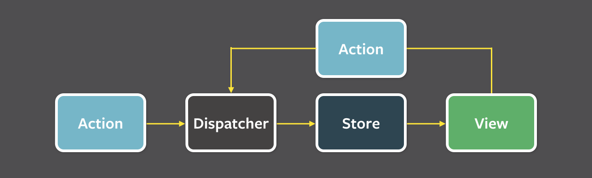

# Flux核心

Flux 是由 Facebook 提出的設計概念，它最重要的思維是**單向資料流**。

## 用來解決什麼問題？

[2014 年 F8 開發者大會](https://www.youtube.com/watch?v=nYkdrAPrdcw&start=621)中，FB 曾經用兩張圖來解釋為什麼他們使用 Flux 代替 MVC。


## 取代原因

因為**雙向資料流而容易產生不好維護**的問題。然而，Flux 更明確的定義了單向資料流中各角色職責及互動方式，提高了可維護性，讓 Facebook 最後選擇了它。

# MVC是什麼？

MVC 是一種軟體架構模式，它的設計概念是以**關注點分離** (separation of concerns, SOC) 為基礎，將應用程式拆解成不同的功能面向，各自處理負責事項，強調團隊分工的概念。

## 三個核心：

1. **Model — 邏輯層**（後端api資料庫）
    1. Model 主要管理與資料邏輯有關的事項，若使用者想要對資料進行「新增、修改、刪除、瀏覽」的動作，都需要透過 Model 中來操作

        例如：電商網站的免運費、計算訂單總額…等等。

2. **View 視圖 — 表現層**（前端頁面的畫面）
    1. 管理第一線與使用者互動的介面(也就是 HTML)
    2. 動態網站，他則會依照 Model 取出的資料內容，動態呈現使用者需要的網頁內容。
3. **Controller 控制器 — 事件層**（控制 API 資料庫接口）
    1. 掌握與瀏覽器之間的互動行為
    2. 負責收發 Request 與 Response，因此，通常會在 Controller 設置不同的事件 Event，進而觸發不同指令完成後續動作。

        例如：當 Controller 收到請求後，Controller 會通知 Model 調度資料，接著再把資料傳遞給 View 來產生樣板，最終將呈現資料的 HTML 頁面回傳到客戶端的瀏覽器。

## 流程：


## MVC造成的問題：

資料 與 視圖 之間的 bi-directional data flow（雙向資料流），容易造成cascading effects （串連效應）的問題。

# Flux是什麼？

## Flux 四個核心簡介：

1. Action：**規範所有改變資料的動作**，讓你可以快速掌握整個 App 的行為。
2. Dispatcher：將目前發生的行為，**告知**給所有已註冊的 Store。
3. Store：存放**資料和業務邏輯**，並且**只提供 getter API** 讓人取得資料。
4. View：根據資料**渲染 UI** 和**傾聽使用者**的操作事件。

### View 畫面監聽與互動

畫面監聽使用者的操作或因使用者產生的互動（想像成是客服，得知user回饋）。使用者對View產生event(也就是監聽中的事件，觸發對應action，或是註冊好的callback)。又會觸發Dispatcher（告知下屬並派任務的主管）去告知該操作對應的事件（負責該任務的下屬）。

### Dispatcher 事件分配者

使用者對View產生event（例如click或input change），View會觸發Dispatcher（想像成是分配任務的主管）。Dispatcher負責找到對應事件的負責人，並分配任務給他，且不會自己處理事件。

```jsx
// 假設你initiate一個dispatcher
var AppDispatcher = new Dispatcher();
//.
//..
//...
//在你的 component.jsx 中，可能會有這樣的程式
// 觸發createNewItem Dispatcher會去分配事件 讓action執行
createNewItem: function( evt ) {
  AppDispatcher.dispatch({
    actionName: 'newImage',
    newItem: { name: 'Cute Cats' } // example data
  });
}

// 渲染按鈕 點擊後觸發createNewItem事件
render: function() {
  return (<button onClick={ this.createNewItem }>New Image</button>);
}
```

### Action 事件說明者

當每次的event發生後，View就會產生event(Action觸發Dispatcher去dispatch一個Action，該Action可以包含一個payload（帶的資料、參數），說明你想做什麼事情以及你需要操作什麼資料。

### Store 唯一資料站

在Flux的概念中，Store基本上是你唯一可以操作資料與儲存資料的地方。想像Store是個資料倉庫，提供 View 使用 listener（監聽器），監聽到資料有無改變。並且，該倉庫負責人會向Dispatcher（倉庫資料有變，透過Action跟主管說）先註冊資料改變後要執行的對應事件（callback）。監聽到資料有改變，就會告知主管，主管（Dispatcher）會根據註冊好的事件去分配任務給該負責的下屬（ Action）。

值得注意的是 store 只提供 getter API 讀取資料，若想改變 state（狀態） 一律發送 action。Store的資料有變，View因資料改變而渲染畫面。

```jsx
// 存放圖片的唯一store
var ImageStore = {
  // collection of model data
  imagesArray: []
}

// 註冊callback 觸發後更新store內的圖片
AppDispatcher.register(function(payload) {
  switch( payload.actionName ) {
    case 'newImage':
      ImageStore.imagesArray.push(payload.newImage);
      break;
  }
})
```

## Flux流程

Action發生 =>  觸發Dispatcher => 更新Store => 最後改變View



## Flux的好處：

1. 你可以快速掌握整個 App 中的行為
2. 資料和業務邏輯也統一存放
3. 讓 View 只需要負責 UI 的排版
4. 測試變得簡單
5. 資料不會互相污染

# MVC真的不好嗎？

User操作View所產生的任何event，都會經由Controller來修改與更動相關的Model，而Model再告知View是否需要做更動，聽起來也是蠻`one-way direction`的呀。

事實上，MVC 跟 Flux 都只是一個概念，因此有各種不同的實作，加上MVC在`資料流`的處理上，並不像Flux一般有較為明確的定義，多數時候Model的更動與View的刷新可能會透過Controller來管理，讓Model單純存放data。

如此一來，假若今天View的操作更動了Model，而Model的變化又刷新了View，在系統龐大的時候，一來一往，就會讓你的資料與頁面狀態變得非常複雜，要追蹤某個頁面的變動到底是誰觸發的，或是哪個資料改變了，你必須從Controller去慢慢trace。

**若是遵照Flux的流程，任何View的update都只要去追蹤其State的來源Store即可，有一個明確的flow可以遵循，並且每個View所需要監聽的資料來源，可以依照Store來區分，這之間的資料流不會互相干擾。**另外一個Flux的好處是，能夠更輕鬆的做出更Unit的Unit test。這是你在複雜的Controller中難以達成的。

# 參考資料

[從 Flux 與 MVC 的差異來簡介 Flux](https://blog.techbridge.cc/2016/04/29/introduce-flux-from-flux-and-mvc/)

[「筆記」- 何謂 MVC 軟體設計模式](https://medium.com/pierceshih/%E7%AD%86%E8%A8%98-%E4%BD%95%E8%AC%82-mvc-%E8%BB%9F%E9%AB%94%E8%A8%AD%E8%A8%88%E6%A8%A1%E5%BC%8F-af1ff10901e6)

[深入淺出 Flux](https://medium.com/4cats-io/%E6%B7%B1%E5%85%A5%E6%B7%BA%E5%87%BA-flux-44a48c320e11)

[Flux 基礎概念與實戰入門](https://www.bookstack.cn/read/reactjs101-zh-tw/Ch07-react-flux-introduction.md)